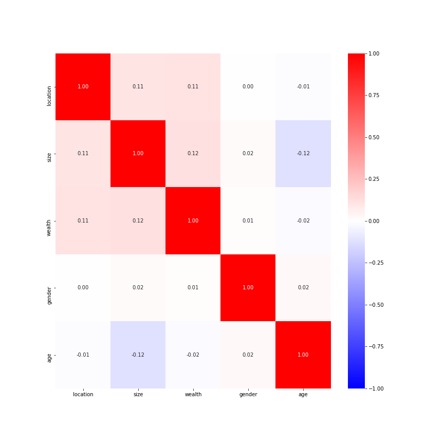
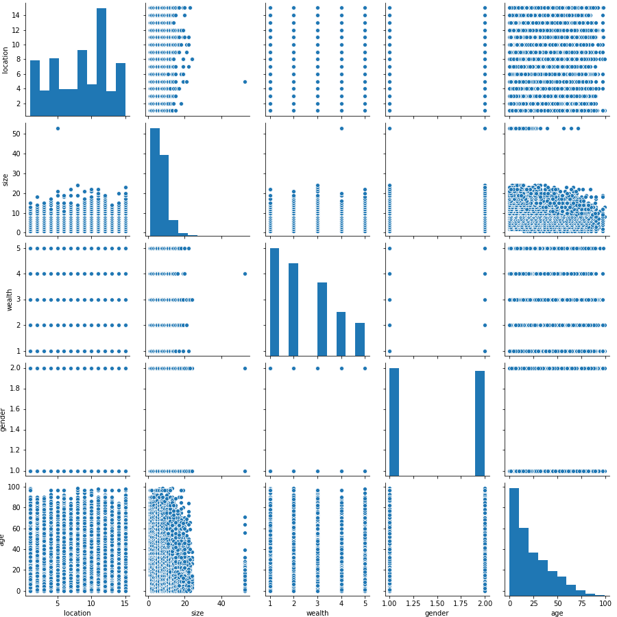
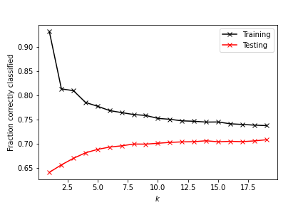
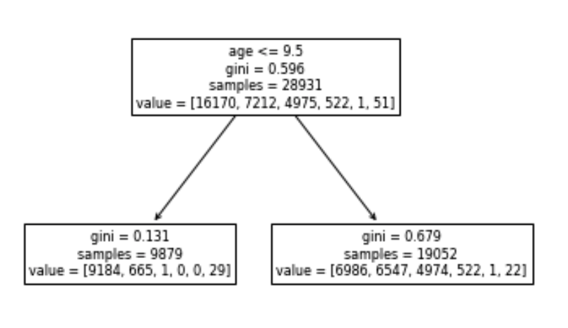

# 146_Extra_Credit

## Initial Analysis of Data

### What is the data? What does the data represent? How is it represented?

The data at hands shows the location, size, wealth, gender, age, and education of 48,218 individuals in Liberia. For ease of later analysis, the data was transformed from a csv to a Panda's data frame. Upon first analysis of the data, it was determined that the initial index was unneeded and switched with a column titled "unnamed: 0." This was because the "unnamed: 0" column represents the index, or the number, of each respondent, so it was used to be the index of the data frame as well.

Similarly, the data was seperated into an X data frame and a y data frame. The y data frame represents the target of prediction for this ananlysis and contains the education levels of the different respondents. The rest of the variables were stored into the X data frame to help predict people's eduction. 

The data was also split into Xtrain, Xtest, ytrain, and ytest data frames using the training testing split function. 60% of the observations were used for training, and 40% were used for testing. A random state of 146 was used for consistency.

### Is there any information we know about the data before we begin the predictions?

At first, I analyzed the correlation between the X variables by displaying a correlation matrix through a heat map representation. Similarly, I looked for irregularites within the X data frame through a pair plot representation. Both of them are shown below.

The heat map demonstrates that the independent variables of the analyis do not present strong linear relationships, because no correlation is above .5. This is extremely crucial to note before comparing models because it suggests that linear based classification systems, such as a logistic regression, will not be the best prediction method.
 _________________________________________________________________________________________________________________________________________________________________ 

The pair plot demonstrates that the data seems to be distributed as it should be. This makes clear that the data is survey data because many of the plots show that answers are clusters within single lines. This is because respondents could only respond with certain answers and were restricted to the domain of whole numbers. 

The last step of the preliminary analysis was to look into the data distribution of the target, education. Digging into the data, the only unique values of education was 0, 1, 2, 3, 8, and 9. The sample mean was .66 and the sample median was 0. This indicates that the majority of respondents are represented with an education of 0 with a few respondents being greater than 0 and some being 9 or 8. 

## Prediction Efficacy Between Logisitic Regression, K-Nearest Neighbors, and Decision Tree Classifiers

### Logistic Regression and Model Validation

A logistic regression classifier was instantiated using different standardizations of data. These were the raw data and data transformed using standard scaler, normalizer, min max scaler, or robust scaler. A logisitc regression was created on the testing/training representation of each data. The accuracy of each regression was compared by comparing the predicted y against the actual y. The accuracies were then added to a dictionary for further comparisons. 

A logisitc regression using the standard scaler for data standardization retained the highest accuracy out of all the logistic regression with an accuracy of .5703. It performed better than the next best accuracy by .0001. In order to validate these results, a KFold validation was performed on the logisitic regression with a standardized version of the data using the standard scaler with K set to 20. 

The KFold validation actually resulted in a mean training accuracy of .5723 and testing accuracy of .5722, both of which are better than the one the one instance of the logistic regression before. However, they were not disimilar enough to warrant the belief that the accuracy reported was out of the normal.

### K-Nearest Neighbors (KNN) and Model Validation

For the KNN Models, a model was created for each data representation. Then for each data representation, a KNN was instantiated for values from 1-20 of neighbors. The testing and training score of each instance was noted inorder to find the best number of neighbors for comparison with other data representations. An image of the plot for the KNN based on the min max scaler is shown below. 

The best number of number of neighbors was chosen by deciding at which part of the plot did the testing score begin to level off or right before both data trended to the same score. This is because with a greater number of neigbors, at one point, the entire plot will be filled by an unmeaningful cluster. Likewise, the nearest neighbors number was chosen by determining which instance did not have too much overfitting or underfitting of the data.

For all data representations, the number of nearest neighbors chosen for model comparison was 6 neighbors. From comparing the different accuracies, it was determined that the min max scaler standardization of the data with a KNN model instatiated at a nearest neighbors equal to 6 out performed all other models with a testing accuracy of .6961, already .1 higher than the logistic regression. 

In order to ensure that this result was not unusual, a KFold validation of this instance of a KNN model was created. The mean training score was .7697 and the mean testing score was .6959. This was an expected result because the KNN model instance before hand had a similar training and testing score. It is important to note that this model is more overfit than the logisitic regression but has better testing accuracy either way. 

Lastly, the difference between inverse distance weighting and regular distance weighting was compared and inverse distance weighting performed worse, so that was not used in the final result.

### Decision Tree and Model Validation

Unlike the other two models, the inherent nature of the decision tree does not necessitate that we use a the need of standardization because it's classification is not based on the distance between the two points. However, the parameters min samples split and max depth were changed and compared to determine the highest accuracy of a decision tree. 

It was determined that a decision tree of max depth 9 and min samples split of 18 had the highest accuracy of .7158. Instance were compared for ever depth between 2 and 20 and every min samples split between 2 and 20. I am confident of having found the highest performing accuracy because the trend of accuracies continued upward before this instance and then trended downwards afterwards. 

A KFold Validation for this instance of the model was created and the mean training accuracy was .7326 with a testing accuracy of .7204. This is significantly less over fit the the KNN model and has a higher accuracy than both the other models. 

In order to visualize a decision tree, an image of a tree with a max depth of 2 was created. From this image, it is apparent that the age of the participant had the greatest determining factor on the prediction of education.

## Final Thoughts
When comparing how overfit each best model was and comparing the testing accuracy of the models, it is clear that the decision tree out performs the linear regression and KNN models in both regards. The use of KFold validation leads me to be confident in my assertion.

For full transparency of my assertions, I have attached images of my code below.
[Code](https://sasan-faraj.github.io/Extra_Credit/extra_credit)
